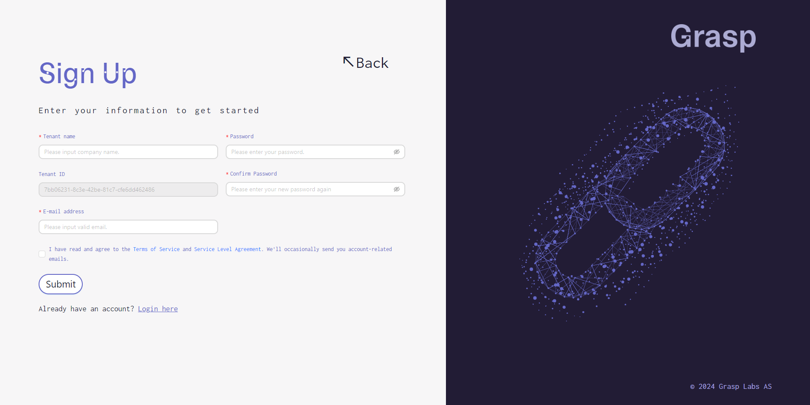
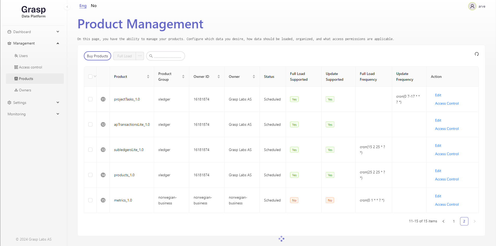
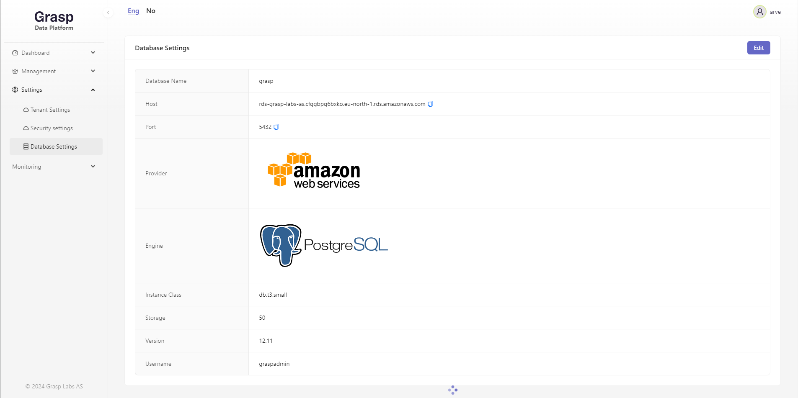
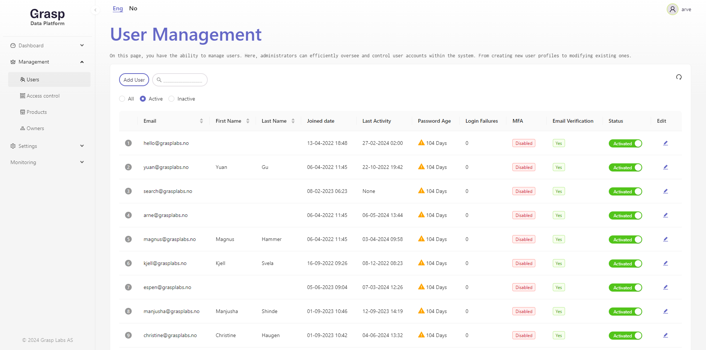
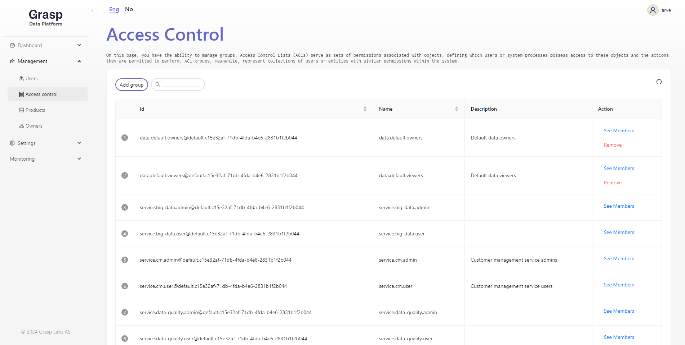
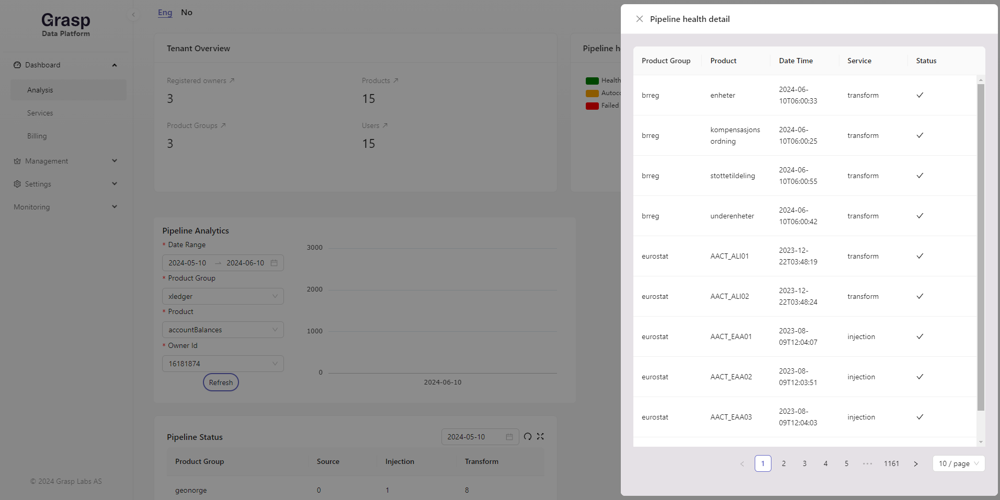
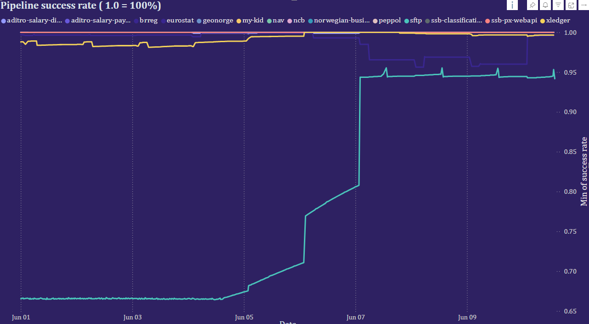

# Get started

## Sign up
To use any of our services you need to sign up and create an account. 
After you have done this you are able to use the interfaces and APIs 
required to build and run a data platform.

## Build
Creating a data platform is an exercise of defining the following:

### Pipelines to move data from source to destination.
  - Pipelines might require your input to allow us to connect to your data.
  - Pipelines might require a frequency to run.

### Storage to hold the data.
  - Depending on if you want to create a data lake or a data warehouse,
  the storage will be different.

### User access to the data.
  - User management to ensure the right people have access to the right data.

 - Access control

### Monitoring to ensure the data is flowing as expected.
  - Pipeline metrics service is a good way to ensure the data is flowing.
  - Log service give you the ability to see what is happening.
  - Notification service to alert you when something goes wrong.
  - Alerts to notify you when something goes wrong.

### Security to ensure the data is protected.
  - Tenant security settings to ensure the data is protected.

## Monitor
Monitoring the data platform is an exercise of ensuring the data is flowing as 
expected. We offer several services to help you monitor your data platform,
in addition to the monitoring services you might already have.

